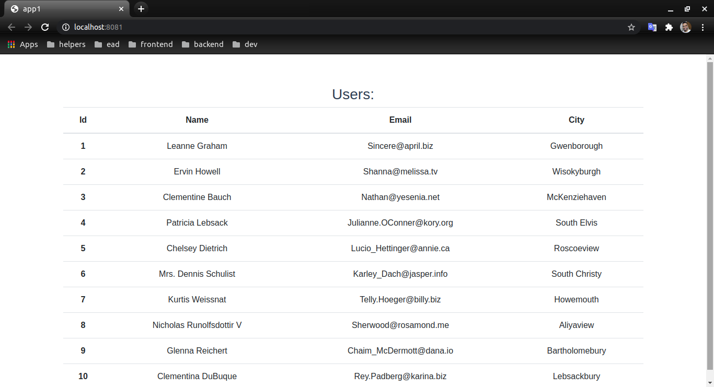

<h1 align="center">
     <a href="#" alt="">Lista: nome, email, cidade </a>
</h1>

<h4 align="center">
	🚧   Concluído 🚀 🚧
</h4>

Tabela de conteúdos
<!--ts-->
   * [Sobre o projeto](#-sobre-o-projeto)
   * [Funcionalidades](#-funcionalidades)
   * [Layout](#-layout)
   * [Como executar o projeto](#-como-executar-o-projeto)
     * [Pré-requisitos](#pré-requisitos)
     * [Rodando o Projeto](#user-content--rodando-o-projeto)
   * [Tecnologias](#-tecnologias)

<!--te-->


## 💻 Sobre o projeto

Um aplicativo Vue.js simples com a obtenção de dados da API. 

Para criar um aplicativo, usei Vue CLI, axios para chamada de API e Bootstrap para estilização. 

Como resultado, obtive um aplicativo com uma lista de usuários no modelo de tabela.


---

## ⚙️ Funcionalidades

- [x] Entender sobre fluxo do Vue.js:
  - [x] como vue.js traz dados 
    - configurações básicas, pois e meu primeiro projeto em vue.js 

---

## 🎨 Layout

O layout da aplicação:

<p align="center">
  
</p>


---

## 🚀 Como executar o projeto

### Pré-requisitos

Antes de começar, você vai precisar ter instalado em sua máquina as seguintes ferramentas:
[Git](https://git-scm.com), [Vue](https://vuejs.org/)

Além disto é bom ter um editor para trabalhar com o código como [VSCode](https://code.visualstudio.com/)

#### 🎲 Rodando o Projeto

```bash
# Clone este repositório
$ git clone git@github.com:leandrojsantos/vue.git

# Acesse a pasta do projeto no terminal/cmd, vá para a pasta raiz do projeto
$ cd vue/list

# Instale as dependências
$ npm install

# Execute a aplicação em modo de desenvolvimento
$ npm run server

# O servidor inciará na porta:8081 - acesse http://localhost:8081

```
---

## 🛠 Tecnologias

As seguintes ferramentas foram usadas na construção do projeto:

([Vue](https://vuejs.org/)  +  [Javascript](https://developer.mozilla.org/pt-BR/docs/Web/JavaScript))

-   **[Axios](https://github.com/axios/axios)**
-   **[Core-js](https://www.npmjs.com/package/core-js)**
-   **[Bootstrap](https://getbootstrap.com/)**

---

